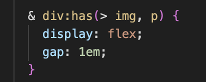
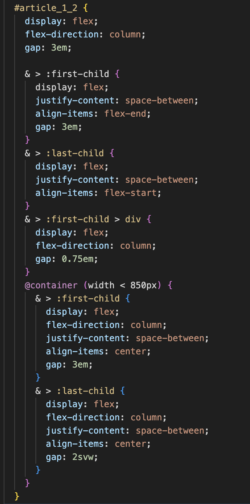
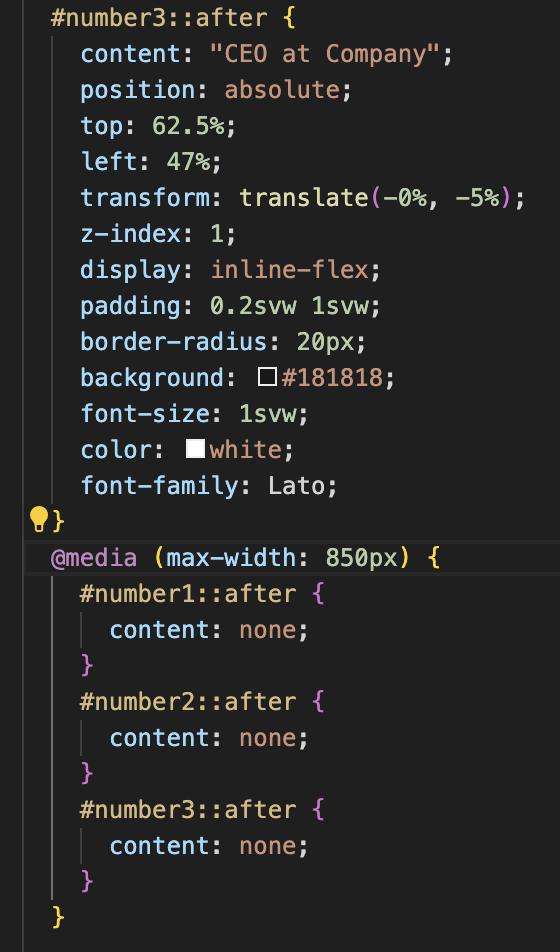
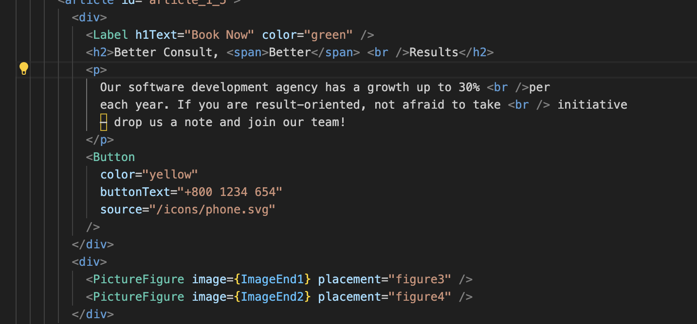

Reflektion

Opgaven startede meget langsomt for mig da jeg var lidt forvirret til at starte med, da jeg skulle vænne mig til at bruge nye metoder til noget jeg nu følte jeg havde ret godt styr på. Det ende heldigvis med at jeg fik okay styr på det, og fandt ud af hvor meget mindre kode man kan ende med at skrive så længe man brugte css selector i stedet for at sætte idé'er og klasser rundt om alt.

Css Nesting har jeg brugt meget hele vejen igennem hele opgaven, da jeg mente det var smart og gjorde det nemmere at holde styr på, hvad der høre til hvad.
Det har også gjort det nemmere i forhold til container quires og den responsive del da jeg i forhold til Astro også har nestet containers i de forskellige componenter, og sammentid gjort det nemmere at holde styr på hele projektet.

Billedet under viser en del af sitet som består af elementer jeg har lavet som componeneter da jeg vidste delene skulle bruge igen på andre sider. For at brugen componentet igen, brugte jeg props for at ændre i værdierne i componentet så både tekst og css blev ændret i forhold til, hvor den hørte til.

